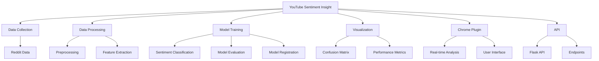

# YouTube Sentiment Insight

## Project Overview

YouTube Sentiment Insight is a comprehensive tool that analyzes sentiment across YouTube comments and correlates this data with other social media platforms (Reddit). The project leverages machine learning to classify sentiments and provides valuable insights for content creators and marketers through an API and Chrome extension.

## Features

* **Multi-platform Sentiment Analysis** : Analyzes sentiment from YouTube comments
* **Machine Learning Classification** : Uses ML models to categorize sentiments into positive, negative, and neutral categories (-1, 0, 1)
* **Interactive Visualizations** : Provides clear visual representations of sentiment patterns including pie charts, wordclouds, and trend analysis
* **Chrome Plugin Integration** : Browser extension for real-time sentiment analysis
* **RESTful API** : Flask-based API for sentiment prediction and visualization generation
* **Comprehensive Error Logging** : Detailed logs for debugging and improvements

## Project Structure



## Directory Structure

```
.
├── artifacts/              # ML model artifacts
├── data/                   # Data storage
│   ├── Reddit_Data.csv     # Reddit dataset
│   ├── Twitter_Data.csv    # Twitter dataset
│   ├── interim/            # Intermediate processed data
│   └── raw/                # Raw data files
├── flask_api/              # API implementation
│   └── main.py             # API entry point with Flask server
├── mlartifacts/            # ML model outputs
├── notebooks/              # Jupyter notebooks for exploration
├── src/                    # Source code
│   ├── data/               # Data processing modules
│   │   └── data_preprocessing.py  # Text preprocessing functions
│   ├── model/              # Model related code
│   │   └── model_evaluation.py    # Model loading and evaluation
│   └── youtube/            # YouTube specific functions
├── yt-chrome-plugin/       # Chrome extension
│   ├── manifest.json       # Extension manifest
│   ├── popup.html          # Extension UI
│   └── popup.js            # Extension functionality
├── .dvcignore              # DVC ignore file
├── .gitignore              # Git ignore file
├── bow_vectorizer.pkl      # Bag of Words vectorizer
├── confusion_matrix_test_data.png  # Confusion matrix visualization
├── dvc.yaml                # DVC pipeline configuration
├── experiment_info.json    # Experiment tracking
├── logistic_regression.pkl # Trained model
├── model_*.log             # Various model logs
└── requirements.txt        # Project dependencies
```

## Installation

1. Clone the repository

```bash
git clone https://github.com/bayuzen19/youtube-sentiment-insight.git
cd youtube-sentiment-insight
```

2. Install dependencies

```bash
pip install -r requirements.txt
```

3. Set up DVC for data version control

```bash
dvc pull
```

## Usage

### Running the Flask API

```bash
python flask_api/main.py
```

This will start the Flask API server on http://0.0.0.0:5000

### Required Models

The API requires the following model files to be present:

* `logistic_regression.pkl`: The trained sentiment classification model
* `bow_vectorizer.pkl`: The Bag of Words vectorizer for text processing

### API Endpoints

The Flask API provides access to sentiment analysis results:

* `/predict`: Analyze sentiment of YouTube comments
  ```json
  POST: {
    "comments": ["This video is amazing!", "I didn't like this content", "Interesting perspective"]
  }
  ```
* `/predict_with_timestamps`: Analyze sentiment with timestamp data
  ```json
  POST: {
    "comments": [
      {"text": "Great tutorial!", "timestamp": "2023-05-15T14:32:10Z"},
      {"text": "This video was disappointing", "timestamp": "2023-05-15T14:35:22Z"}
    ]
  }
  ```
* `/generate_chart`: Create pie chart of sentiment distribution
  ```json
  POST: {
    "sentiment_counts": {"1": 250, "0": 100, "-1": 50}
  }
  ```
* `/generate_wordcloud`: Generate wordcloud from comments
  ```json
  POST: {
    "comments": ["Great video", "Amazing content", "Very helpful tutorial"]
  }
  ```
* `/generate_trend_graph`: Create monthly sentiment trend visualization
  ```json
  POST: {
    "sentiment_data": [
      {"sentiment": 1, "timestamp": "2023-01-15T14:32:10Z"},
      {"sentiment": -1, "timestamp": "2023-02-10T09:15:22Z"},
      {"sentiment": 0, "timestamp": "2023-02-12T16:45:30Z"}
    ]
  }
  ```

### Chrome Extension

1. Load the extension from the `yt-chrome-plugin` directory in Chrome's Developer mode
2. Navigate to any YouTube video
3. Click the extension icon to see real-time sentiment analysis

## Model Performance

The current sentiment classification model (logistic regression) achieves the following performance on test data:

### Confusion Matrix

From the confusion matrix visualization (`confusion_matrix_test_data.png`), we can see:


|          | Predicted 0 | Predicted 1 | Predicted 2 |
| ---------- | ------------- | ------------- | ------------- |
| Actual 0 | 1008        | 319         | 344         |
| Actual 1 | 52          | 2465        | 70          |
| Actual 2 | 234         | 399         | 2468        |

The model shows strong performance in classifying the three sentiment categories, with particularly high precision for classes 1 and 2.
